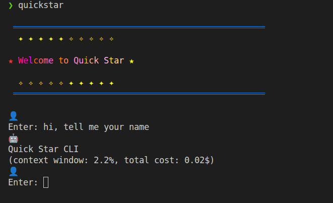
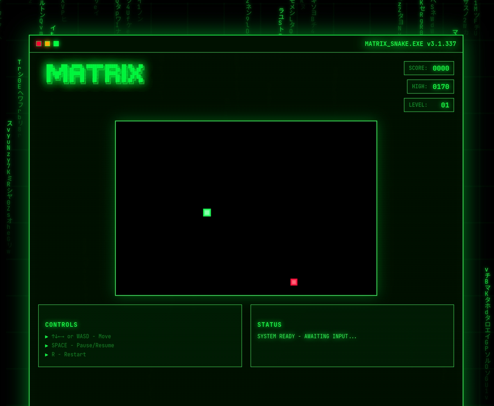

# Agent Learning Project

**[中文版本 / Chinese Version](README_zh.md)**

## 🚀 Experience Quick Star CLI in Action!



**✨ Try Quick Star CLI now!** An intelligent AI agent with elegant command-line interface, real-time streaming responses, and powerful code generation capabilities.

## 🎮 See What's Possible: Snake Game Created by AI!



**🎯 Play the snake game!** This fully functional game was created entirely through natural language conversations with Quick Star CLI, showcasing:
- 🧠 **Intelligent Code Generation** - Complete game logic from simple descriptions
- 🔧 **Real-time Debugging** - Iterate and improve code instantly  
- 📁 **Smart File Management** - Handle complex project structures
- 🎨 **Interactive Applications** - Create engaging user experiences

**Ready to build something amazing?** Follow the installation guide below and start creating with Quick Star CLI!

---


This project demonstrates the progressive development of AI agents, from basic tool calling to advanced streaming agents with history control. Each chapter builds upon the previous one, showing incremental improvements and new features.

## Project Structure

```
├── .env                          # Environment configuration (shared by all chapters)
├── .env.example                  # Environment template
├── requirements.txt              # Python dependencies
├── chapter1_tool_call_api/       # Basic tool calling examples (Native Function Call & XML Tool Call)
├── chapter2_ReAct_agent/         # Basic ReAct agent implementation
├── chapter3_stream_agent/        # Streaming agent with real-time responses
├── chapter4_history_control/     # Advanced agent with conversation history management
├── chapter5_smart_context/       # Smart context management with intelligent cropping
└── chapter6_to_do_write/         # Task management with TodoWrite tool [NEW]
```

## Features by Chapter

### Chapter 1: Tool Call API
- **Native Function Call**: Standard OpenAI function calling interface with JSON Schema
- **XML Tool Call**: Flexible tool calling using XML format in natural language
- Comparison of two different tool calling approaches
- Basic API client setup and tool execution
- Foundation for understanding tool calling patterns

### Chapter 2: ReAct Agent
- Basic ReAct (Reasoning and Acting) pattern implementation
- Tool calling capabilities building on Chapter 1 concepts
- API client with environment variable configuration
- Error handling for missing environment variables

### Chapter 3: Stream Agent
- All features from Chapter 2
- **NEW**: Real-time streaming responses
- **NEW**: Progressive output display
- Enhanced user experience with live feedback

### Chapter 4: History Control
- All features from Chapter 3
- **NEW**: Conversation history management
- **NEW**: Context compression when reaching token limits
- **NEW**: Memory optimization for long conversations


### Chapter 5: Smart Context Management
- All features from Chapter 4
- **NEW**: Smart context cropping with TOP/BOTTOM strategies
- **NEW**: Intelligent user denial reason capture  
- **NEW**: Enhanced error handling with unified exception management
- **NEW**: Singleton pattern for HistoryManager ensuring state consistency
- **NEW**: SmartContextCropper tool for precise message management
- **NEW**: Advanced debugging support with VSCode configurations
- **NEW**: Comprehensive safety guarantees protecting user messages

### Chapter 6: TodoWrite Tool - Task Management [NEW]
- All features from Chapter 5
- **NEW**: TodoWrite tool for structured task management and progress tracking
- **NEW**: Intelligent task organization with automatic todo list creation
- **NEW**: Real-time progress monitoring and status updates
- **NEW**: Smart decision engine for task complexity analysis
- **NEW**: Context-aware task management with proactive detection
- **NEW**: Quality assurance integration with test validation
- **NEW**: Automatic reminder system for pending task management
- **NEW**: Visual progress indicators and completion validation


## Prerequisites

- Python 3.8 or higher
- Conda (recommended) or pip
- OpenAI-compatible API access (OpenRouter, OpenAI, etc.)

## Installation Instructions

### 1. Clone the Repository

```bash
git clone https://github.com/woodx9/build-your-claude-code-from-scratch.git
cd build-your-claude-code-from-scratch
```

### 2. Create and Activate Conda Environment

```bash
# Create new conda environment
conda create -n agentLearning python=3.11

# Activate environment
conda activate agentLearning
```

### 3. Install Dependencies

You can install dependencies using any of the following methods:

#### Option 1: Install from requirements.txt
```bash
# Install all required packages
pip install -r requirements.txt
```

#### Option 2: Install in Development Mode (Recommended for Development)
```bash
# 或者其他chapter
cd chapter5_smart_context

pip install -e .
```

#### Option 3: Run
```bash
quickstar
```

#### Option 4: Successful Run
```bash
❯ quickstar

 ══════════════════════════════════════════════════
   ✦ ✦ ✦ ✦ ✦ ✧ ✧ ✧ ✧ ✧ 

★ Welcome to Quick Star ★

   ✧ ✧ ✧ ✧ ✧ ✦ ✦ ✦ ✦ ✦ 
 ══════════════════════════════════════════════════

👤
请输入: hello, relpy one
🤖
Hello! Nice to meet you. How can I help you today?                                                
👤
请输入: 
```

### 4. Environment Configuration

1. Copy the example environment file:
   ```bash
   cp .env.example .env
   ```

2. Edit `.env` file with your API credentials:
   ```bash
   # OpenAI API Configuration
   OPENAI_API_KEY=your_api_key_here
   OPENAI_BASE_URL=https://openrouter.ai/api/v1
   OPENAI_MODEL=anthropic/claude-sonnet-4
   # The unit is k
   MODEL_MAX_TOKENS=200
   COMPRESS_THRESHOLD=0.8
   ```

### 5. Required Environment Variables

| Variable | Description | Example |
|----------|-------------|---------|
| `OPENAI_API_KEY` | Your API key | `sk-or-v1-...` |
| `OPENAI_BASE_URL` | API endpoint URL | `https://openrouter.ai/api/v1` |
| `OPENAI_MODEL` | Model to use | `anthropic/claude-sonnet-4` |
| `MODEL_MAX_TOKENS` | Max tokens for responses (in thousands) | `200` |
| `COMPRESS_THRESHOLD` | History compression threshold (0.0-1.0) | `0.8` |

## Usage

### Running Chapter 1 (Tool Call API Examples)

```bash
cd chapter1_tool_call_api

# Run Native Function Call example
python native_function_call.py

# Run XML Tool Call example  
python xml_tool_call.py
```

## API Providers

This project supports any OpenAI-compatible API. Tested providers include:

- **OpenRouter** (recommended): Provides access to multiple models
- **OpenAI**: Official OpenAI API
- **Local LLM servers**: Any server implementing OpenAI API format

### OpenRouter Setup

1. Sign up at [openrouter.ai](https://openrouter.ai)
2. Get your API key from the dashboard
3. Use `https://openrouter.ai/api/v1` as the base URL
4. Choose from available models like:
   - `anthropic/claude-sonnet-4`
   - `openai/gpt-4`
   - `meta-llama/llama-3.1-70b-instruct`

### OpenAI Setup

1. Get API key from [platform.openai.com](https://platform.openai.com)
2. Use `https://api.openai.com/v1` as the base URL
3. Use models like `gpt-4`, `gpt-3.5-turbo`

## Development

### Project Structure (Each Chapter)

```
chapter_X/
├── src/
│   ├── core/
│   │   ├── api_client.py      # API client with environment config
│   │   └── conversation.py    # Conversation management
│   ├── tools/
│   │   ├── base_agent.py      # Base agent implementation
│   │   ├── tool_manager.py    # Tool management
│   │   └── cmd_runner.py      # Command execution tool
│   └── main.py                # Entry point
├── pyproject.toml             # Project configuration
└── readme.md                  # Chapter-specific documentation
```

**Note**: Chapter 1 has a simpler structure with direct Python files demonstrating tool calling concepts.

### Key Components

- **APIClient**: Singleton pattern client with environment variable configuration
- **BaseAgent**: Core agent logic implementing ReAct pattern
- **ToolManager**: Manages available tools and their execution
- **ConversationManager**: Handles conversation history and context

### Error Handling

The project includes comprehensive error handling:

- Missing environment variables throw descriptive errors
- API failures are caught and reported
- Tool execution errors are handled gracefully

## Troubleshooting

### Common Issues

1. **Environment variables not found**
   ```
   ValueError: 环境变量 OPENAI_API_KEY 未设置或为空。请检查 .env 文件中的配置。
   ```
   **Solution**: Ensure `.env` file exists and contains all required variables

2. **API connection failed**
   ```
   API请求失败: Connection error
   ```
   **Solution**: Check your internet connection and API endpoint URL

3. **Invalid API key**
   ```
   API请求失败: Unauthorized
   ```
   **Solution**: Verify your API key is correct and has sufficient credits

### Testing Environment Setup

```bash
# Test if environment variables are loaded correctly
python -c "
import sys
sys.path.append('chapter2_ReAct_agent/src')
from core.api_client import APIClient
client = APIClient()
print('✅ Environment loaded successfully!')
print(f'Using model: {client.model}')
"
```

## Contributing

1. Fork the repository
2. Create a feature branch
3. Make your changes
4. Test thoroughly
5. Submit a pull request

## License

This project is for educational purposes. Please respect the terms of service of your chosen API provider.

## Support

For issues and questions:
1. Check the troubleshooting section
2. Review chapter-specific README files
3. Open an issue on the repository

---

**Note**: This project demonstrates progressive AI agent development. Start with Chapter 1 to understand basic tool calling concepts, then move to Chapter 2 for ReAct patterns, Chapter 3 for streaming capabilities, and finally Chapter 4 for advanced history management.

## Chapter Comparison: Evolution of Features

| Feature | Chapter 1 | Chapter 2 | Chapter 3 | Chapter 4 | Chapter 5 |
|---------|-----------|-----------|-----------|-----------|-----------|
| Tool Calling | ✅ Basic | ✅ ReAct | ✅ ReAct | ✅ ReAct | ✅ ReAct |
| Real-time Streaming | ❌ | ❌ | ✅ NEW | ✅ | ✅ |
| History Management | ❌ | ❌ | ❌ | ✅ NEW | ✅ |
| Auto Compression | ❌ | ❌ | ❌ | ✅ NEW | ✅ |
| Cost Tracking | ❌ | ❌ | ❌ | ✅ NEW | ✅ |
| **Smart Cropping** | ❌ | ❌ | ❌ | ❌ | ✅ **NEW** |
| **Enhanced UX** | ❌ | ❌ | ❌ | ❌ | ✅ **NEW** |
