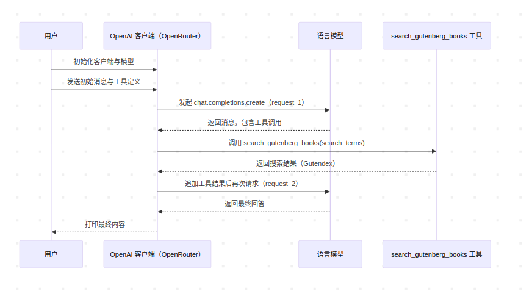
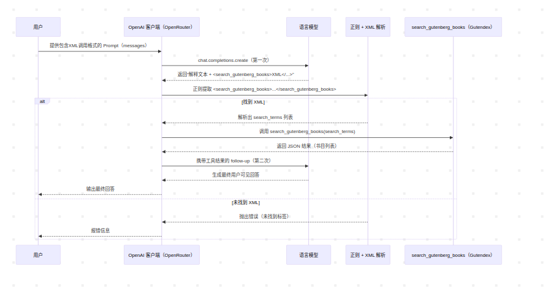

# Tool Call API 学习指南

本章节介绍了两种不同的工具调用方式：Native Function Call 和 XML Tool Call。

## 目录
- [概述](#概述)
- [Native Function Call](#native-function-call)
- [XML Tool Call](#xml-tool-call)
- [两种方式对比](#两种方式对比)
- [使用场景建议](#使用场景建议)
- [参考资料](#参考资料)

## 概述

在与大语言模型交互时，我们经常需要让模型调用外部工具来获取实时数据或执行特定操作。目前主要有两种实现方式：

1. **Native Function Call**: 使用 OpenAI 标准的 function calling 接口
2. **XML Tool Call**: 通过 XML 格式在自然语言中嵌入工具调用

## Native Function Call

### 核心特点
- 使用标准化的 JSON Schema 定义工具接口
- 模型返回结构化的工具调用请求
- 支持多轮对话和工具链式调用
- 更加规范和可靠

### 实现流程



### 关键代码结构

**1. 工具定义**
```python
tools = [
  {
    "type": "function",
    "function": {
      "name": "search_gutenberg_books",
      "description": "Search for books in the Project Gutenberg library",
      "parameters": {
        "type": "object",
        "properties": {
          "search_terms": {
            "type": "array",
            "items": {"type": "string"},
            "description": "List of search terms to find books"
          }
        },
        "required": ["search_terms"]
      }
    }
  }
]
```

**2. 工具调用处理**
```python
# 处理模型返回的工具调用
for tool_call in response.tool_calls:
    args = json.loads(tool_call.function.arguments)
    tool_result = search_gutenberg_books(**args)
    messages.append({
        "role": "tool",
        "tool_call_id": tool_call.id,
        "name": tool_call.function.name,
        "content": json.dumps(tool_result)
    })
```

### 优点
- 结构化程度高，易于验证和调试
- 支持复杂的参数类型定义
- 错误处理更加完善
- 工具调用的可追踪性强

### 缺点
- 需要严格按照 OpenAI 的接口规范
- 对于不支持 function calling 的模型无法使用
- 实现相对复杂

## XML Tool Call

### 核心特点
- 在自然语言回答中嵌入 XML 格式的工具调用
- 更加灵活，不依赖特定的 API 接口
- 可以与解释性文本结合
- 适用于任何支持文本生成的模型

### 实现流程



### 关键代码结构

**1. Prompt 设计**
```python
prompt = """
When you decide to call a tool, output in this format:

[Some natural language explanation for the user]
<search_gutenberg_books>
  <search_terms>term1</search_terms>
  <search_terms>term2</search_terms>
  ...
</search_gutenberg_books>

Rules:
1. The <search_gutenberg_books> block must be valid XML.
2. The explanation can be any helpful text for the user, but outside the XML tags.
3. Keep XML block on separate lines, do not nest other tags inside.
"""
```

**2. XML 解析**
```python
# 正则提取XML内容
xml_match = re.search(r"<search_gutenberg_books>[\s\S]*?</search_gutenberg_books>", model_text)
xml_str = xml_match.group(0)

# 解析XML参数
root = ET.fromstring(xml_str)
search_terms = [elem.text for elem in root.findall("search_terms")]
```

### 优点
- 实现简单，不依赖特定API
- 可以与自然语言解释无缝结合
- 适用于任何文本生成模型
- 更加直观和可读

### 缺点
- 依赖正则表达式解析，可能不够健壮
- 缺乏严格的类型检查
- 错误处理相对简单
- XML 格式可能被模型错误生成

## 两种方式对比

| 特性 | Native Function Call | XML Tool Call |
|------|---------------------|---------------|
| **实现复杂度** | 中等 | 简单 |
| **模型兼容性** | 仅支持 function calling 的模型 | 所有文本生成模型 |
| **类型安全** | 高（JSON Schema 验证） | 低（需要手动验证） |
| **错误处理** | 完善 | 基础 |
| **可读性** | 结构化 | 更加直观 |
| **灵活性** | 受限于 API 规范 | 高度灵活 |
| **调试难度** | 容易 | 中等 |

## 使用场景建议

### 选择 Native Function Call：
- 使用支持 function calling 的模型（如 GPT-4、Claude 3.5）
- 需要严格的参数验证和类型检查
- 构建生产级应用，对可靠性要求高
- 需要复杂的工具链式调用

### 选择 XML Tool Call：
- 使用不支持 function calling 的模型
- 需要快速原型开发
- 希望工具调用与自然语言解释结合
- 对实现复杂度有限制

## 实际应用示例

选择哪种方式主要取决于你的具体需求、模型支持情况和技术栈约束。在选择工具调用方式之前，需要根据模型评测的结果来实现，哪种工具调用方式调用成功率高，就选择哪一种。

## 参考资料

[Claude Function Calling](https://docs.anthropic.com/zh-CN/docs/agents-and-tools/tool-use/overview)
