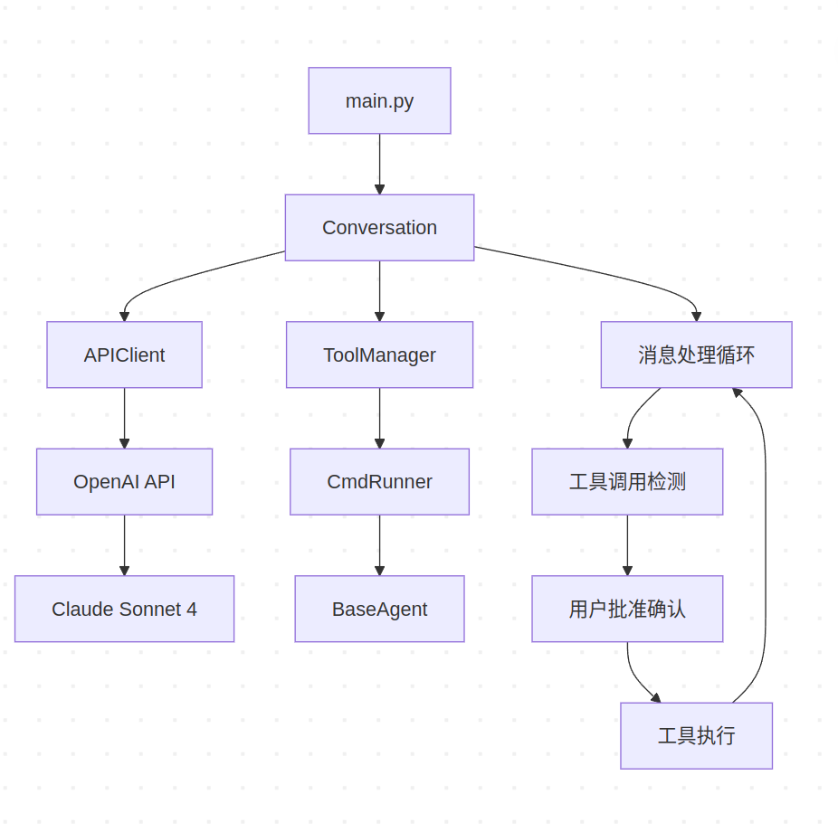

# QuickStar - ReAct Agent

一个基于 ReAct（Reasoning and Acting）模式的 AI 代理系统，支持工具调用和用户交互。

## 系统架构



ReAct（Reasoning and Acting）架构通过以下核心流程实现智能代理：

1. **思考（Think）**：AI 模型接收输入并进行推理
2. **行动（Act）**：基于推理结果调用相应工具
3. **观察（Observe）**：获取工具执行结果作为反馈
4. **循环迭代**：将观察结果输入下一轮思考，形成完整的推理-行动循环

这种架构使 AI 代理能够在复杂任务中保持连贯的推理链，并通过工具调用与外部环境交互。


## 核心组件

### Conversation 对话管理器


[`Conversation`](src/core/conversation.py) 是系统的核心控制器，采用单例模式设计：

- **递归消息处理**：通过 `recursive_message_handling()` 实现持续的对话循环
- **工具调用检测**：自动识别 AI 响应中的工具调用请求
- **用户批准机制**：危险操作需要用户明确确认
- **错误处理**：完整的异常捕获和恢复机制

关键流程：
1. 发送消息到 AI 模型
2. 检查响应是否包含工具调用
3. 如需批准，等待用户确认
4. 执行工具并将结果反馈给 AI
5. 递归继续对话

### ToolManager 工具管理器

[`ToolManager`](src/tools/tool_manager.py) 负责工具的注册、描述和执行：

- **工具注册**：统一管理所有可用工具
- **描述生成**：为 AI 提供工具的 JSON Schema 描述
- **执行代理**：根据工具名称分发执行请求

### 工具系统

所有工具继承自 [`BaseAgent`](src/tools/base_agent.py)，目前实现了：

- **CmdRunner**：执行系统命令，支持超时控制和用户批准

## 快速开始

```bash
# 安装依赖
pip install -e .

# 运行程序
quickstar
```

## 配置说明

API 配置在 [`APIClient`](src/core/api_client.py) 中：
- 使用 OpenRouter 作为 API 网关
- 默认模型：Claude Sonnet 4
- 支持自定义 API Key 和 Base URL


这个框架的核心思想是让 AI 能够"思考"（通过对话）和"行动"（通过工具调用），并且在执行可能有风险的操作时需要用户确认，实现了一个安全可控的 AI 代理系统。
