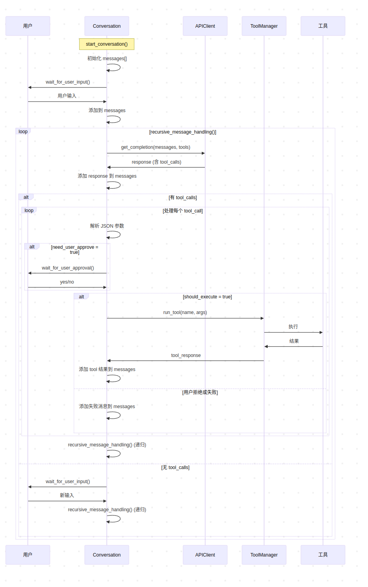

# QuickStar - Stream Agent

[中文版本](./README_zh.md)

A ReAct (Reasoning and Acting) based AI agent system supporting **real-time streaming output**, tool calling, and user interaction.

## 🚀 Chapter3 Major Updates

### 1. Real-time Streaming Output

Chapter3's core upgrade is the **real-time streaming output** functionality:
- ✨ **Real-time Response**: Users can see AI assistant generating replies character by character, like real human typing
- 🔄 **Streaming Tool Calls**: Supports tool call handling in streaming mode
- 💡 **Graceful Degradation**: Automatically switches to standard mode if streaming fails
- 🎯 **Optimized User Experience**: Reduces waiting time and improves interaction feel

#### 🎮 User Experience Comparison

**Chapter2 (Standard Mode)**
```
👤 Input: Help me list files in current directory
🤖 [Wait 3-5 seconds] I'll help you list files in the current directory...
```

**Chapter3 (Streaming Mode) ✨**
```
👤 Input: Help me list files in current directory  
🤖 I'll help you list files in the current directory...
[Real-time character-by-character display, no waiting]
```

### 2. UI Interface Refactoring

#### 🎨 Interface Optimization
- Optimized user interface for streaming experience
- Improved visual feedback during tool execution
- Updated real-time interaction progress indicators
- Enhanced layout for streaming mode to improve readability

### 3. API Configuration Externalization

#### 🔧 Configuration Management Updates
- **API Client Configuration Externalized** (`src/core/api_client.py`)
    - Added `python-dotenv` dependency for environment variable management
    - Removed hardcoded API keys and configuration info
    - Dynamically reads the following configurations from environment variables:
        - `OPENAI_API_KEY`: OpenAI API key
        - `OPENAI_BASE_URL`: API base URL
        - `OPENAI_MODEL`: Model name to use
    - Added configuration validation mechanism ensuring required environment variables are set

#### 🔒 Security Improvements
- Sensitive information (API keys) no longer stored directly in code
- Supports different configurations for different environments
- Improved code maintainability and security

#### 📁 Environment Configuration Files
- Added `.env.example` template file containing required environment variable examples
- Created `.env` file for local environment configuration (added to .gitignore)

#### Usage Method
1. Copy `.env.example` to `.env`
2. Fill in actual API configuration information in `.env` file
3. Ensure `python-dotenv` dependency is installed

## System Architecture


The ReAct (Reasoning and Acting) architecture implements intelligent agents through the following core workflow:

1. **Think**: AI model receives input and performs reasoning
2. **Act**: Calls appropriate tools based on reasoning results
3. **Observe**: Gets tool execution results as feedback
4. **Iterate**: Feeds observation results into the next round of thinking, forming a complete reasoning-action loop

This architecture enables AI agents to maintain coherent reasoning chains in complex tasks and interact with external environments through tool calls.

## Core Components

### 🌊 APIClient - Streaming API Client

[`APIClient`](src/core/api_client.py) now supports two modes:

**Standard Mode** (Compatible with Chapter2):
```python
def get_completion(self, request_params) -> Message
```

**🆕 Streaming Mode** (Chapter3 New):
```python
def get_completion_stream(self, request_params) -> Generator[str, None, None]
```

Streaming mode features:
- Returns AI-generated content chunk by chunk
- Supports tool call handling in streaming responses
- Automatically builds complete response message objects
- Exception handling and error recovery

### 💬 Conversation - Streaming Conversation Manager



[`Conversation`](src/core/conversation.py) streaming enhancements:

**🆕 Streaming Output Methods**:
- `print_streaming_content()` - Real-time display of AI-generated content fragments
- `recursive_message_handling()` - Upgraded to support streaming processing

**Core Workflow**:
1. 🔄 Send message to AI model (streaming)
2. 📺 Real-time display of AI reply content
3. 🔍 Check if response contains tool calls
4. ☝️ If approval needed, wait for user confirmation
5. ⚡ Execute tool and feed results back to AI
6. 🔁 Recursively continue conversation

### ToolManager

[`ToolManager`](src/tools/tool_manager.py) remains unchanged, fully compatible with streaming mode:

- **Tool Registration**: Unified management of all available tools
- **Description Generation**: Provides JSON Schema descriptions of tools for AI
- **Execution Proxy**: Dispatches execution requests based on tool names

### Tool System

All tools inherit from [`BaseAgent`](src/tools/base_agent.py), currently implementing:

- **CmdRunner**: Executes system commands with timeout control and user approval

## Quick Start

```bash
# Install dependencies
pip install -e .

# Configure environment variables
cp .env.example .env
# Edit .env file, fill in actual API configuration

# Run the program
quickstar

# Test streaming functionality
python test_streaming.py
```

## 🔧 Technical Implementation Details

### Streaming Response Handling
```python
for chunk in stream:
        if chunk.choices[0].delta.content:
                content_chunk = chunk.choices[0].delta.content
                full_content += content_chunk
                yield content_chunk  # Real-time output
```

### Tool Call Handling in Streaming
```python
# Collect tool call information in streaming response
if hasattr(chunk.choices[0].delta, 'tool_calls'):
        # Gradually build tool call objects
        # Ensure tool call information is complete
```

### Error Handling and Degradation
```python
try:
        # Try streaming mode
        for chunk in stream_generator:
                # Handle streaming response
except Exception as e:
        # Auto-degrade to standard mode
        response = self._api_client.get_completion(request)
```

## 🎯 Chapter3 vs Chapter2

| Feature | Chapter2 | Chapter3 |
|---------|----------|----------|
| Response Mode | Batch return | 🆕 Real-time streaming |
| User Experience | Need to wait | 🆕 Instant feedback |
| Tool Calling | ✅ Supported | ✅ Streaming support |
| Error Handling | ✅ Basic | 🆕 Graceful degradation |
| Code Compatibility | - | ✅ Backward compatible |
| API Configuration | Hardcoded | 🆕 Environment variables |
| Security | Basic | 🆕 Configuration externalized |

The core idea of this framework is to let AI "think" (through conversation) and "act" (through tool calls), and require user confirmation when executing potentially risky operations. Chapter3's streaming output further enhances user experience, making interactions more natural and smooth, while improving system security and maintainability through configuration externalization.
